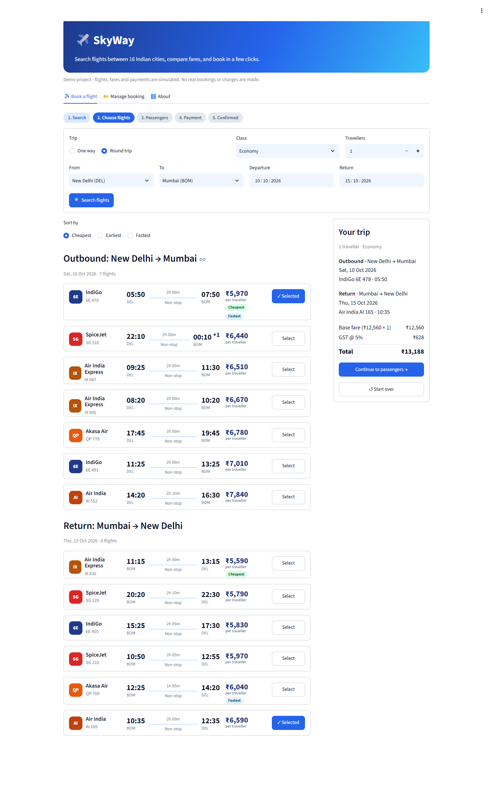
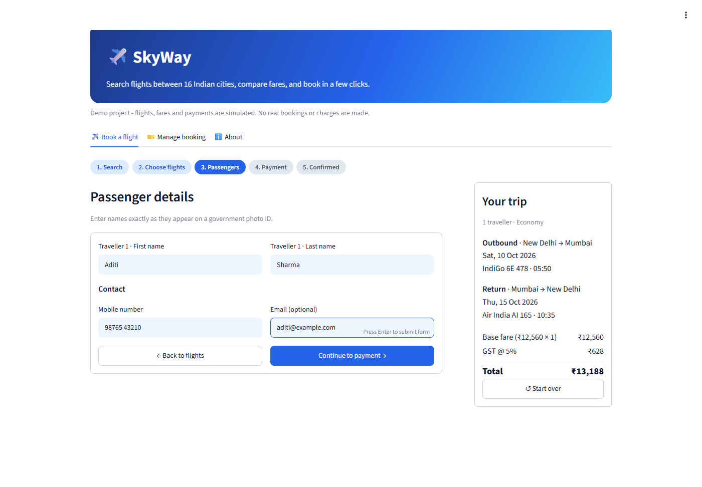
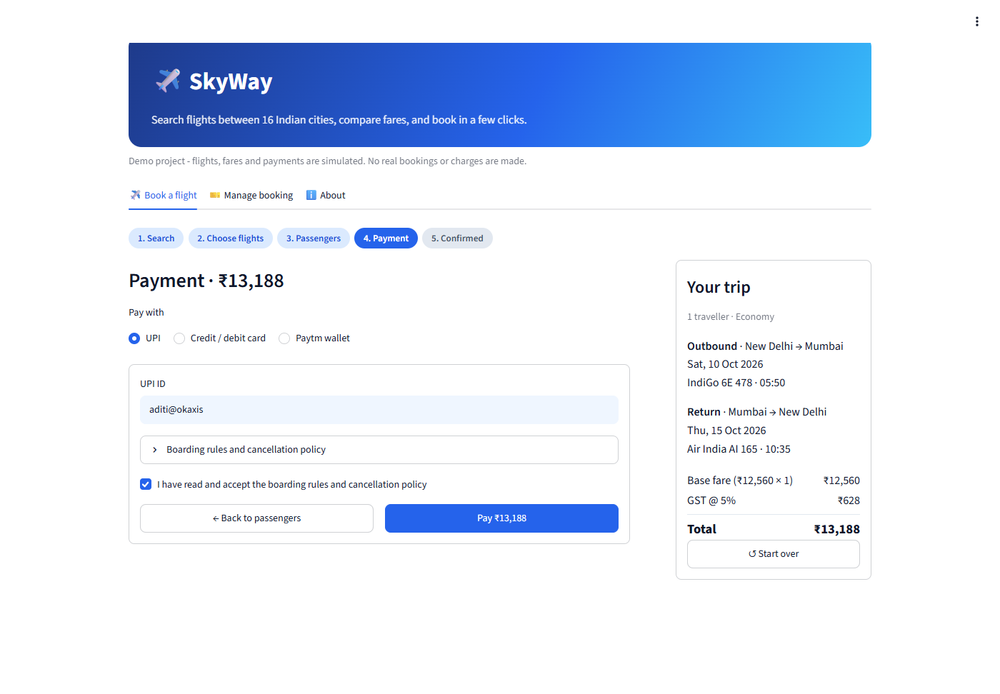
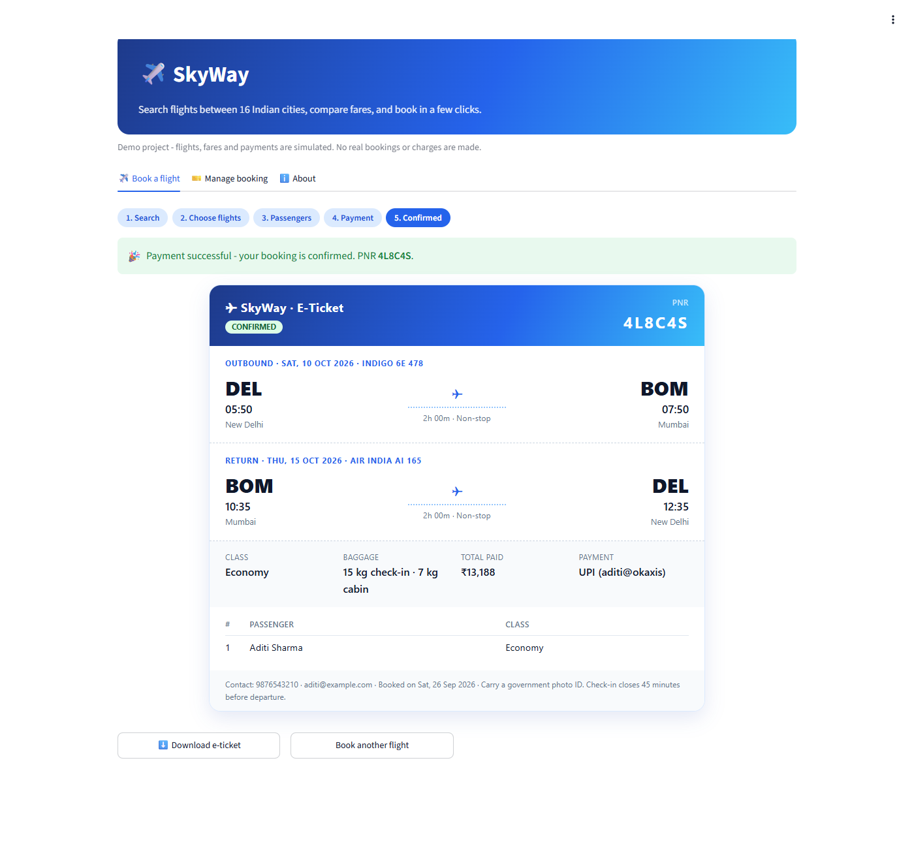
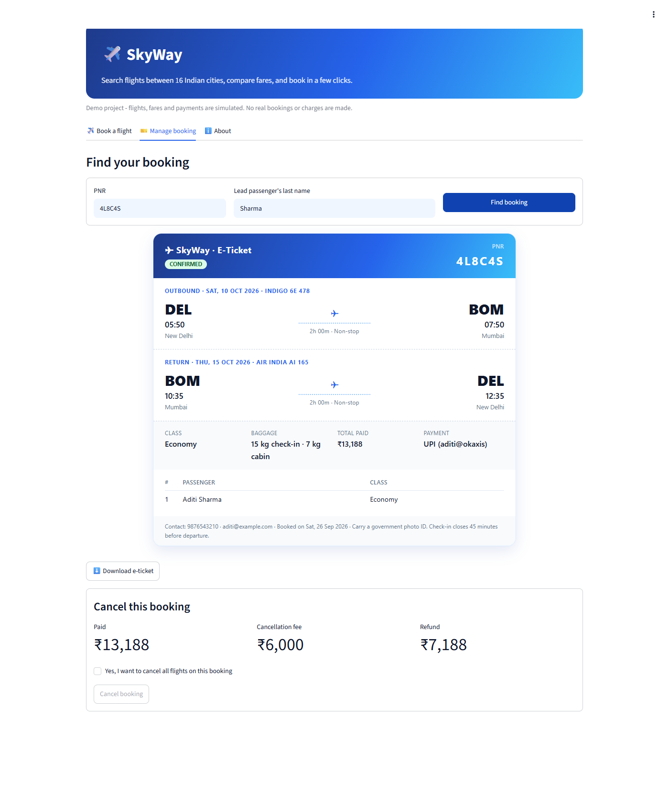

# Flight Reservation System

A flight-booking simulator in two versions:

- **SkyWay**, an interactive web app built with Python and Streamlit.
- The original C++17 console program.

In both you can search flights, pick a cabin class, pay, get an e-ticket with a PNR, and later view or cancel the booking.



## Web app (SkyWay)

- **Search** one-way or round-trip flights between 16 Indian airports for 1–9 travellers, in Economy, Premium Economy or Business.
- **Realistic results:**
  - Durations and base fares come from real great-circle distances between airports.
  - Fares rise closer to departure and on weekends.
  - Each search shows five airlines with flight numbers, departure and arrival times, and duration.
  - Results can be sorted by price, departure time or duration, with *Cheapest* and *Fastest* badges.
- **Seats:** seats left go down as seats are booked, and sold-out flights can't be selected.
- **Live fare summary** showing base fare × travellers, GST (5% or 12%) and the total.
- **Passenger details:**
  - A name for every traveller, validated.
  - Indian mobile number and optional email.
- **Payment:**
  - UPI, with the UPI ID checked.
  - Credit or debit card, with a Luhn check, expiry date and CVV. Only the last 4 digits are kept; the CVV is never stored.
  - Paytm wallet.
- **E-ticket** with a 6-character PNR, shown in the app and downloadable as a printable HTML file.
- **Manage booking:** find a booking by PNR and last name, see the cancellation fee and refund, and cancel.

| Passengers | Payment |
|---|---|
|  |  |

| E-ticket | Manage booking |
|---|---|
|  |  |

### Run it locally

```sh
pip install -r requirements.txt
streamlit run streamlit_app.py
```

Bookings are stored in `bookings.db` (SQLite) next to the app. Set `FLIGHT_DB` to use a different file.

### Deploy it for free

1. Sign in to [Streamlit Community Cloud](https://share.streamlit.io) with GitHub.
2. Click **Create app** and pick this repository.
3. Keep the default main file `streamlit_app.py` and deploy.

Community Cloud storage is temporary, so demo bookings are cleared whenever the app restarts.

### Web app tests

```sh
pip install -r requirements.txt -r requirements-dev.txt
pytest
```

There are 19 tests:
- **Unit tests:** search, fares, validation, PNRs and storage.
- **End-to-end tests** with Streamlit's `AppTest`:
  - a one-way booking paid by UPI, then found and cancelled by PNR
  - a round trip in Business class for 2 travellers, paid by card
  - validation errors at each step

## Console app (C++)

### Features

- **One-way and round-trip bookings** for 1–9 travellers.
- **Real date validation:** leap years and days per month are checked. Travel must be within the next 365 days, and the return date can't be before departure. A same-day return must leave at least an hour after the outbound flight lands.
- **Three cabin classes:** Economy, Premium Economy and Business, each with its own fare multiplier and GST rate (5% or 12%).
- **Flight search:** five airlines with flight numbers, departure and arrival times, duration and fare. The same route and date always shows the same flights.
- **Review and edit** name, travellers, route, dates or class before choosing a flight.
- **Fare breakdown:** base fare × travellers, GST, and total payable.
- **Payment:**
  - UPI, with the UPI ID checked.
  - Paytm wallet.
  - Credit or debit card: the card number is checked with the Luhn algorithm and the expiry date is checked. Only the last 4 digits are kept, and the CVV is never stored.
- **E-ticket** with a 6-character PNR, printed on screen and appended to `tickets.txt`.
- **View or cancel a booking** using the PNR and last name. Cancelling shows the fee and refund.
- **Saved bookings:** bookings are kept in `bookings.tsv` between runs.

### Build and run

You need a C++17 compiler (GCC 8+, Clang 7+ or MSVC 2019+).

```sh
make          # builds ./flight
make run      # builds and starts the program
make test     # runs the end-to-end smoke test
```

Without `make`:

```sh
g++ -std=c++17 -Wall -Wextra -O2 flight.cpp -o flight
./flight
```

It works on Windows, Linux and macOS.

On Windows with MinGW, add `-static` to the command. Otherwise the program may load a different `libstdc++-6.dll`, such as the one bundled with Git for Windows, and crash. The Makefile does this automatically.

### Fares

| Class           | Fare multiplier | GST |
|-----------------|-----------------|-----|
| Economy         | 1.0×            | 5%  |
| Premium Economy | 1.6×            | 12% |
| Business        | 2.8×            | 12% |

Cancellation fee: ₹3,000 per traveller per flight (capped at the amount paid).

### Testing

`tests/smoke_test.sh` runs two scripted sessions:

1. The first books a round trip, with deliberate invalid input at each step, plus a declined booking and a one-way UPI booking.
2. The second restarts the program and views and cancels the booking by PNR, which checks that bookings are saved between runs.

Two environment variables make runs reproducible:

| Variable | Purpose |
|---|---|
| `FLIGHT_TODAY=YYYY-MM-DD` | Pretend today is this date |
| `FLIGHT_SEED=<number>` | Make generated PNRs reproducible |

GitHub Actions builds and tests on Linux and Windows on every push.

## Project layout

```
streamlit_app.py        # SkyWay web app
flightapp/core.py       # flight search, fares, validation, PNRs
flightapp/store.py      # SQLite booking storage
flightapp/ticket.py     # e-ticket HTML
tests/                  # web app tests (pytest)
flight.cpp              # C++ console app
tests/smoke_test.sh     # C++ end-to-end test
docs/screenshots/       # screenshots used in this README
```

## Limitations

This is a learning project. No real flights are searched and no real payments are made; all flights, fares and payments are simulated.
